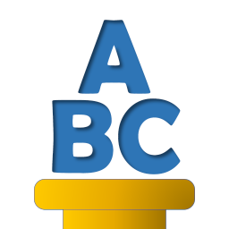

.. HydrOffice ABC documentation master file.

###############
The ABC package
###############

.. toctree::
    :maxdepth: 1
    :numbered:

    in_brief
    user_manual
    developer_guide
    license
    credits

.. only:: html

    * :ref:`genindex`
    * :ref:`search`

.. note::
    © University of New Hampshire, Center for Coastal and Ocean Mapping, 2021. All rights reserved.

