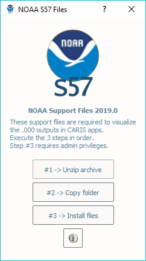

Info Tab
========

The Info Tab contains numerous helpful links and utilities:

	* The homepage
	* The Online User Manual
	* The Offline User Manual (PDF)
	* License Information
	* Authors List
	* NOAA S-57 Support Files for CARIS
	* The HydrOffice Main Page
	* The Center for Coastal and Ocean Mapping Main Page
	* The University of New Hampshire Main Page

|

-----------------------------------------------------------

|

NOAA S-57 Support Files for CARIS
^^^^^^^^^^^^^^^^^^^^^^^^^^^^^^^^^

These allow for use of customized S-57 attributes in CARIS software and are required in order to visualize
many of the S-57 (.000) outputs.

To install them, follow these instructions:

* Click the button on the Info Tab for the **NOAA S57 Files**.

.. image:: _static/info_tab_s57.png
    :align: center
    :alt: logo

|

|

* Click the button to unzip the archive.
* Click the button to copy the folder. If the folder is already found, you will be prompted whether or not you wish to force a re-copy.
* Click the button to install the files. Note this step requires Administrator privileges.
* Follow the prompts in the Windows command to complete the installation.

.. image:: _static/support_cmd.png
    :align: center
    :alt: logo
